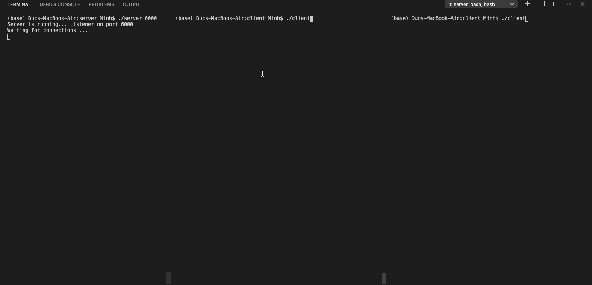

# Millionaire

## Table of contents
* [General Info](#general-info)
* [Members/Contributors](#member)
* [Technology](#technology)
* [Setup](#setup)
* [Demo](#demo)

## General Info
Vietnamese version of gameshow "Who wants to be a millionaire" written in C and run directly on terminal.

## Member
<a href="https://github.com/minhld99/Millionaire/graphs/contributors">
  
</a>

## Technology
Socket Programming in C
* TCP Protocol
* Multithreading
* Select
* SQLite3 (Database)

## Setup
<b>For running on local:</b>
- Uncomment this line `servaddr.sin_addr.s_addr = htonl(INADDR_ANY);`
- Open the same port on server and client side:  `For example: $ ./server 5000`

<b>If server & client are on different network</b>: 
- Port forwarding needed... 
<br><i>(which could be done through ssh or modem config)</i>

1. <b> Open server (on one's Device) </b>
```
$ cd server
$ make
$ ./server 8000 (port that you forward to in local)
```

2. <b> Run client app (On others Device) </b>
```
$ cd client
$ make
$ ./client
$ (then enter server external IP address & port that you forward from)
```

## Demo

